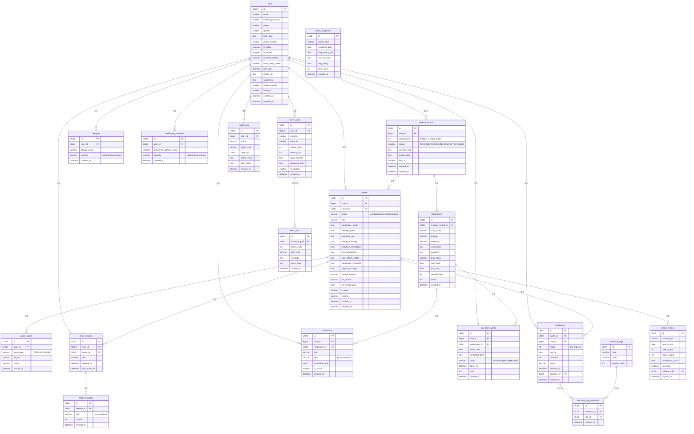

# ERD (Entity Relationship Diagram)

```mermaid
erDiagram
    users {
        BigInt id PK
        varchar email
        varchar hashed_password
        varchar name
        varchar gender
        date birth_date
        varchar phone_number
        boolean is_active
        boolean is_admin
        boolean is_email_verified
        varchar email_verify_token
        datetime last_login
        float height_cm
        float weight_kg
        varchar oauth_provider
        varchar oauth_id
        datetime created_at
        datetime updated_at
    }

    medical_records {
        UUID id PK
        BigInt user_id FK
        int record_type "0:처방전 1:약봉투 2:알약"
        varchar status "PENDING|PROCESSING|COMPLETED|FAILED"
        text ocr_raw_text
        json parsed_data
        varchar file_url
        datetime created_at
        datetime updated_at
    }

    medications {
        UUID id PK
        UUID medical_record_id FK
        varchar drug_name
        varchar dosage
        varchar frequency
        text instructions
        text warnings
        varchar drug_class
        date start_date
        date end_date
        int interval_days
        text memo
        datetime created_at
    }

    guides {
        UUID id PK
        BigInt user_id FK
        UUID record_id FK
        varchar status "pending|processing|done|failed"
        varchar title
        json medication_guide
        json lifestyle_guide
        text summary_text
        json allergy_warnings
        json condition_interactions
        json drug_interactions
        json side_effects_watch
        json medication_schedule
        json urgent_warnings
        varchar prompt_version
        varchar llm_model
        float llm_temperature
        boolean is_read
        datetime read_at
        datetime created_at
        datetime updated_at
    }

    guide_assets {
        UUID id PK
        UUID guide_id FK
        varchar asset_type "TTS|CARD_IMAGE"
        varchar file_url
        varchar status
        datetime created_at
    }

    chat_sessions {
        UUID id PK
        BigInt user_id FK
        UUID guide_id FK
        varchar title
        datetime created_at
        datetime last_active_at
    }

    chat_messages {
        UUID id PK
        UUID session_id FK
        varchar role "user|assistant"
        text content
        datetime created_at
    }

    notifications {
        UUID id PK
        BigInt user_id FK
        UUID medication_id FK
        varchar title
        varchar type "push|sms|email"
        time scheduled_time
        boolean is_active
        datetime created_at
    }

    calendar_events {
        UUID id PK
        BigInt user_id FK
        UUID medication_id FK
        date event_date
        time scheduled_time
        varchar status "PENDING|TAKEN|MISSED"
        datetime taken_at
        text note
        datetime created_at
    }

    allergies {
        UUID id PK
        BigInt user_id FK
        varchar allergy_name
        varchar severity "mild|moderate|severe"
        datetime created_at
    }

    underlying_diseases {
        UUID id PK
        BigInt user_id FK
        varchar underlying_disease_name
        varchar severity "mild|moderate|severe"
        datetime created_at
    }

    feedbacks {
        UUID id PK
        UUID guide_id FK
        BigInt user_id FK
        int rating "0:부정 1:긍정"
        json tag_ids
        text comment
        varchar status
        datetime deactive_at
        BigInt deactive_by FK
        datetime created_at
    }

    feedback_tags {
        UUID id PK
        varchar type
        varchar label
        int display_order
    }

    feedback_tag_selections {
        UUID id PK
        UUID feedback_id FK
        UUID tag_id FK
        datetime created_at
    }

    model_metrics {
        UUID id PK
        varchar model_type
        float latency_ms
        int token_input
        int token_output
        float confidence_score
        boolean success
        UUID reference_id FK
        datetime created_at
    }

    metric_snapshots {
        UUID id PK
        varchar model_type
        date snapshot_date
        float avg_latency_ms
        float success_rate
        float avg_rating
        int total_count
        datetime created_at
    }

    access_logs {
        UUID id PK
        BigInt user_id FK
        varchar method
        varchar endpoint
        int status_code
        int latency_ms
        text request_body
        text response_body
        varchar ip_address
        datetime created_at
    }

    error_logs {
        UUID id PK
        UUID access_log_id FK
        int status_code
        varchar error_type
        text message
        text stack_trace
        datetime created_at
    }

    audit_logs {
        UUID id PK
        BigInt actor_id FK
        varchar action
        varchar target_type
        UUID target_id
        json before_value
        json after_value
        datetime created_at
    }

    %% 사용자 중심 관계
    users ||--o{ medical_records : "업로드"
    users ||--o{ guides : "보유"
    users ||--o{ chat_sessions : "개설"
    users ||--o{ notifications : "설정"
    users ||--o{ calendar_events : "일정"
    users ||--o{ allergies : "등록"
    users ||--o{ underlying_diseases : "등록"
    users ||--o{ feedbacks : "작성"
    users ||--o{ access_logs : "요청"
    users ||--o{ audit_logs : "행위"

    %% 의료기록 → 의약품 → 알림/캘린더
    medical_records ||--o{ medications : "포함"
    medical_records ||--o{ guides : "생성"
    medications ||--o{ notifications : "알림"
    medications ||--o{ calendar_events : "일정"

    %% 가이드 → 챗봇 / 피드백 / 에셋 / 메트릭
    guides ||--o{ chat_sessions : "연결"
    guides ||--o{ feedbacks : "평가"
    guides ||--o{ guide_assets : "에셋"
    guides ||--o{ model_metrics : "측정"

    %% 챗봇
    chat_sessions ||--o{ chat_messages : "포함"

    %% 피드백 태그
    feedbacks ||--o{ feedback_tag_selections : "태그선택"
    feedback_tags ||--o{ feedback_tag_selections : "선택됨"

    %% 로그
    access_logs ||--o{ error_logs : "오류기록"
```
